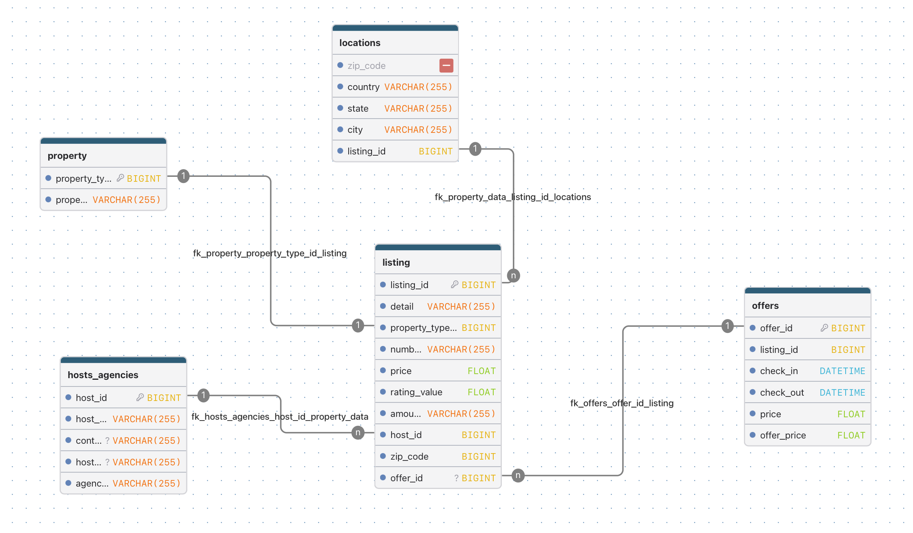

# Unique Stays Curator

## An Airbnb Investment Analysis — Where Should the Next Dollar Go?

This project analyzes a real-world Airbnb listings dataset to advise a fictional private real-estate investor on where to invest in short-term rentals: by property type, by U.S. location, and by individual listing. The project combines Python and MySQL in a single analytics workflow. Python and pandas handled data loading, cleaning, and transformation, while MySQL stored the cleaned, relational dataset and powered the structured analytical queries.
 

The main business problem is:

> **Which property types, locations, and individual listings deserve marketing and partnership investment — based on proven guest satisfaction and popularity, not just raw price?**

## Team

| Team Member | Role |
| --- | --- |
| Lara Caçador | Program Manager, Database Design & Investment Analysis |
| Kseniia Lukhlina | Data Analyst, Market Overview & City Analysis |
| Angélica Roa | Data Analyst, Data Cleaning & Geolocation |


## Business Overview

Our team acted as a data analytics consultancy approached by a private real-estate investor. He had capital ready to deploy in short-term rentals but no time or patience to sift through a flat, unstructured dataset himself. He asked us to turn raw Airbnb listing data into a clear, evidence-based recommendation: **where does a short-term rental actually make money, and why?**

To answer that, we needed to understand the business behind the data, which means to understand:
- which property types already show proven demand
- which locations can back that demand up with reliable numbers (not just a handful of outlier listings)
- where early signals of untapped opportunity exist for future expansion.

## Business Questions

1. **Property type:** Which property types combine strong guest satisfaction (rating) and strong popularity (review count), and which are already saturated with supply?
2. **Location —> US market:** Which US cities have enough listings to trust the numbers, and which of those show the strongest combination of demand and satisfaction?
3. **Individual listings:** Are there specific listings, anywhere in the world, that already show proven quality (near-perfect ratings) but remain underpriced and under-reviewed, that could translate into early candidates for a future international expansion?
4. **Price as a signal:** Does price actually predict quality or demand in this market, or is it an unreliable signal worth exploiting?


## Dataset

- **Source:** [Airbnb Listing Data for Data Science](https://www.kaggle.com/datasets/joyshil0599/airbnb-listing-data-for-data-science)

- **License:** Provided under Kaggle's standard dataset terms of use — see the dataset page for full licensing details.

- **Raw size:** 953 rows, 7 columns (`Title`, `Detail`, `Date`, `Price(in dollar)`, `Offer price(in dollar)`, `Review and rating`, `Number of bed`)

- **Main variables:** listing title (property type + location embedded in text), a date-range offer field, price and offer price, a combined rating + review-count field, and number of beds.

- **Key limitations:**
  - No host information exists in the source data (no host name, ID, or contact fields).
  - Date fields are text ranges with no year (e.g. `"Jun 11 - 16"`) — a year was never invented or assumed.
  - Location information is embedded in free text and formatted inconsistently across rows.

## Database Design

The database (`CrossDataHosts`, MySQL) is organized into four relational tables:

- **`property`** — property type dictionary (`property_type_id`, `property_type_name`)
- **`locations`** — unique locations (`location_id`, `country`, `state`, `city`)
- **`listing`** — one row per unique physical listing (`listing_id`, `detail`, `property_type_id` FK, `location_id` FK, `number_of_bed`, `price`, `rating_value`, `amount_of_answers`, `host_id`)
- **`offers`** — one row per individual scraped offer (`offer_id`, `listing_id` FK, `check_in`, `check_out`, `price`, `offer_price`)



**Key design decisions:**

- `check_in` / `check_out` are stored as `VARCHAR(255)`, not `DATETIME`. The raw data only contains date ranges like `"Jun 11 - 16"` with no year. Casting that to a real date type would mean fabricating data that isn't there.

- `listing` and `offers` are separate tables in a 1:N relationship because the same physical listing can appear multiple times in the raw data with different dates and prices. Modeling this as one listing with multiple offers, rather than duplicate listings, keeps the data honest.

- `host_id` exists in the schema but is unused. The source dataset contains no host information, so the field was left empty rather than fabricated.

## Data Preparation

The original dataset required substantial cleaning before it could support reliable analysis.

**Main issues identified:**

- 34 exact duplicate rows (953 → 919 unique rows)

- A combined `Review and rating` field mixing a rating and a review count in one string, with `"New"` listings having no rating at all

- Property type and location both embedded inside a single free-text `Title` field

- Location formatted inconsistently — sometimes just a city, sometimes city + country, sometimes city + state + country

- Price and offer price stored as text with thousands separators (e.g. `"1,463.00"`)


**Cleaning process:**

- Removed exact duplicate rows.

- Split `Review and rating` into a numeric `rating` and an integer `amount_of_answers` (review count); `"New"` listings were converted to a proper null value rather than zero, to avoid biasing averages.

- Split `Title` into `property_type` and `location` using the `" in "` separator.

- Split `location` into `city`, `state`, and `country` by detecting which of three formats each row used (240 city-only, 554 city+country, 125 city+state+country).
- Converted `price` and `offer_price` from text to numeric values by stripping thousands separators.

- Deduplicated listings by their `detail` field to build the `listing` table (839 unique physical listings), while preserving every individual offer (919 rows) in the `offers` table.

**Note on 839 vs. 919:** the original file has 919 unique rows after removing exact duplicates, but the same physical listing can appear more than once with different dates and prices. The `listing` table counts each physical property once (839); the repeated appearances are preserved separately in `offers` (919). No data was lost, it was simply modeled correctly as one listing with multiple offers.

**Geolocation exploration:** as part of data preparation, US locations with a missing country were resolved by matching their state name, narrowing the dataset to 108 clean, uniquely identified US locations. The real latitude and longitude coordinates were successfully computed for these locations using a geocoding approach, which is a foundation for a future geographic visualization tool. This will be picked up again as a "Phase 2" idea in our recommendations.

## SQL Analysis

Four SQL queries answer our core business questions (full queries in `sql_scripts/query_database.sql` and `notebooks/02_sql_analysis.ipynb`):

1. **Property type performance** — joins `listing` and `property`, grouping by property type (types with fewer than 10 listings excluded as unreliable) to compare average rating and review count.
2. **US city performance** — joins `listing` and `locations`, filtered to the US market, requiring at least 5 listings per city to be considered a reliable signal.
3. **Hidden gem listings** — identifies individual listings worldwide with a rating of +4.9 but very few reviews and a price below the dataset average, using a subquery to compute the average price threshold dynamically.
4. **Price correlation** — pulls price, rating, and review count for every listing to test whether price actually predicts quality or demand.

## Python Analysis

Python (pandas, matplotlib, seaborn) was used for exploratory data analysis and visualization on top of the SQL query results:

- A Pearson correlation was computed between price, rating, and review count across all 839 listings, visualized as an annotated heatmap (`figures/correlation_heatmap.png`).
- Average review count by property type was visualized as a horizontal bar chart, highlighting the gap between under-supplied niche types and saturated mainstream types (`figures/property_type_reviews.png`).

------ 

## Key Findings

1. ******Niche property types outperform saturated ones.****** 

 *Guesthouse, Dome, and Guest suite* lead in both rating (~4.9) and popularity (300–400+ average reviews), but have very few listings (10–22) -> proven demand, limited supply. *Apartment and Home* have the highest volume (105–107 listings) but lower rating and popularity —> already-crowded market.


2. ******Only two U.S. cities meet a reliable sample-size bar.******

Applying a minimum of 5 listings per city (to avoid one-off outliers skewing the average) leaves only *Malibu, CA* and *Miami Beach, FL*. 

Malibu leads with $110,621 average annual revenue per listing and 14.5% year-over-year growth (***source: AirROI, industry data, trailing 12 months Aug 2025–Jul 2026***) AND backed by an official ***California Coastal Commission report*** noting that Malibu's 21-mile coastline is served by only ~130 hotel rooms, meaning short-term rental demand there reflects a real structural gap, not a passing trend. 

Miami Beach also clears the reliability bar, but its own zoning code — the City of Miami Beach Resiliency Code (Secs. 7.5.4.11(a) and 7.5.4.13(d)(E)) -> more information on https://www.miamibeachfl.gov/business/vacation-short-term-rentals/) — bans short-term rentals in most residential zones, making it a more complex, location-dependent opportunity.

3. ******21 "hidden gems" listings worldwide combine proven quality with low visibility.******

All rated a perfect 5.0, priced well below the dataset average (e.g. a room in Bali for $29/night, an apartment in Istanbul for $34/night). These are genuine candidates for a future international expansion once the US strategy proves out.

4. ******Price does not reliably predict quality or demand.****** The correlation between price and rating is weak (r = 0.17); between price and review count it is close to zero (r = −0.04). This validates finding #3: the hidden gems aren't cheap because they're low quality, *they're cheap because the market hasn't caught up to them yet.*

------

## Business Recommendations

**Phase 1 — invest now:**
- Prioritize marketing and partnership investment in under-supplied, high-demand property types (***Guesthouse, Dome, Guest suite***) over already-saturated mainstream types.
- Focus immediate US investment on ***Malibu, CA*** —> the only city in our data with both a reliable sample size and independent, government-documented evidence of structural demand.


**Phase 2 — prepare for expansion:**
- Treat the 21 globally-identified "hidden gem" listings as an early signal for international expansion, once the Phase 1 strategy is validated.
- Build on the geolocation groundwork already started (108 US locations geocoded) to develop a proper map-based visualization tool for identifying future opportunities.

------

## Limitations

- Several findings — particularly the US city analysis — rely on small sample sizes (as few as 5–6 listings per city). We addressed this by setting an explicit reliability threshold rather than presenting every number with equal confidence, but the underlying dataset itself is limited.
- No host-level data exists in the source dataset, so host-side factors (response rate, experience, etc.) could not be analyzed.
- Date fields lack a year, so seasonal or year-over-year trends within this dataset could not be directly analyzed from the raw data.

------

## Repository Structure

```text
first_project/
│
├── Airbnb_Data/
├── data/
│   ├── raw/
│   └── clean/
├── figures/
├── notebooks/
├── slides/
├── sql_scripts/
├── src/
├── config.yaml
├── pyproject.toml
├── uv.lock
└── README.md
```

### `data/raw`

The original, unmodified dataset (`airnb.csv`).

### `data/clean`

The four cleaned datasets used to populate the database: `01_property.csv`, `02_locations.csv`, `03_listing.csv`, `04_offers.csv`.

### `figures`

Exported charts and diagrams: the correlation heatmap, the property-type bar chart, and the Entity-Relationship Diagram.

### `notebooks`

Jupyter notebooks covering each stage of the workflow: data cleaning, database creation and loading, and SQL/Python analysis.

### `slides`

The final investor pitch presentation.

### `sql_scripts`

`create_database.sql` (schema creation) and `query_database.sql` (the four analytical queries).

### `src`

Reserved for reusable Python functions; not used in this project, as all work is organized within notebooks.

## How to Run the Project

### 1. Clone the repository

```bash
git clone https://github.com/lalahunter/first_project.git
cd first_project
```

### 2. Install UV

macOS/Linux:

```bash
curl -LsSf https://astral.sh/uv/install.sh | sh
```

Windows PowerShell:

```powershell
powershell -ExecutionPolicy ByPass -c "irm https://astral.sh/uv/install.ps1 | iex"
```

### 3. Create and sync the environment

```bash
uv sync
```

### 4. Activate the environment

macOS/Linux:

```bash
source .venv/bin/activate
```

Windows:

```powershell
.venv\Scripts\activate
```

### 5. Set up the database

Run the notebooks in `notebooks/` in order. The first notebook cleans the raw data; the second creates the MySQL database (`CrossDataHosts`) and loads the four cleaned tables; the third runs the SQL analysis and generates the Python visualizations. You will be prompted for your local MySQL password when connecting.

### 6. Review the analysis and presentation

SQL queries are available standalone in `sql_scripts/query_database.sql`. The final presentation is in `slides/`.

## Conclusion

This project shows that short-term rental investment decisions shouldn't be driven by raw price alone, because price barely predicts quality or demand in this market.

 Instead, the strongest, most defensible recommendation comes from combining proven satisfaction (rating), proven popularity (review count), and a disciplined reliability threshold that excludes one-off outliers. That approach points clearly to under-supplied niche property types and to **Malibu, CA** as the strongest immediate opportunity, backed independently by a government report — with a second wave of globally-scattered, still-undiscovered listings as evidence that the opportunity doesn't stop at the US border.
